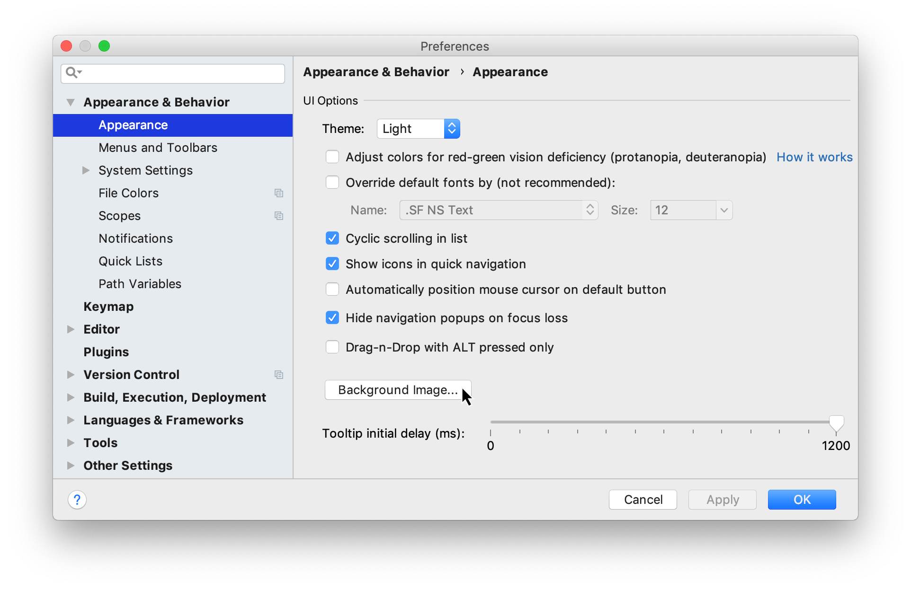
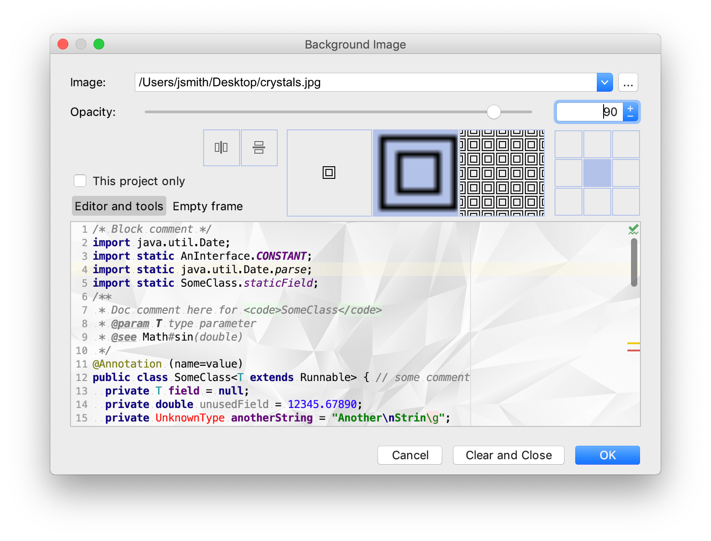

您可以将任何图像设置为 intellijidea 中的编辑器和所有工具窗口的自定义背景。

- 打开 Settings/Preferences 对话框 something，选择 Appearance & Behavior | Appearance，然后单击 Background Image 按钮。

  

- 在“背景图像”对话框中，指定您要使用的图像作为背景，其不透明度、填充和放置选项。如果有必要，垂直或水平镜像。您可以为编辑器和工具窗口以及空框架(编辑器中没有打开任何文件时)设置单独的映像。

如果要仅为当前项目设置图像，请选中“仅为此项目设置图像”复选框。

如果在编辑器中打开图像或将其添加到“项目”工具窗口中，可以右键单击图像并在上下文菜单中单击“设置背景图像”。您还可以使用 Find Action 命令 something a 来执行 Set Background Image 操作。
