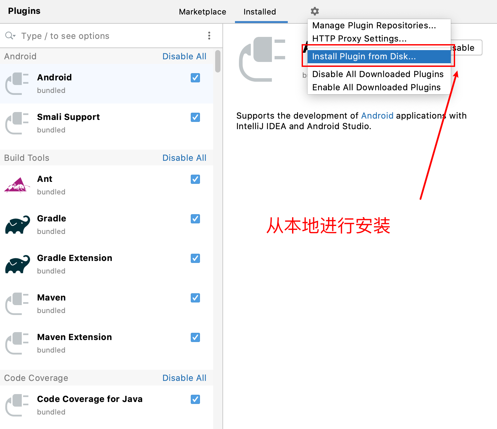
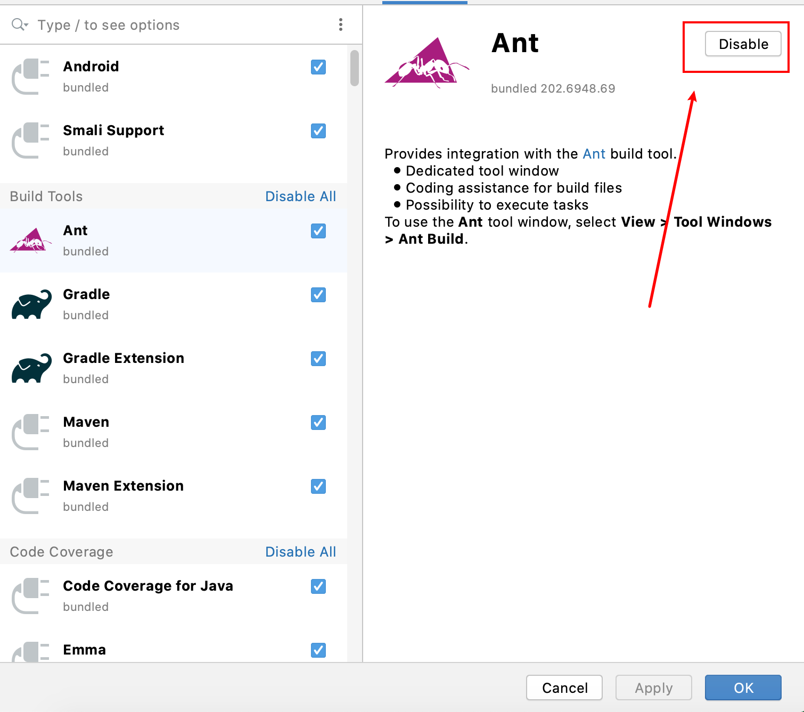

插件扩展了 IDEA 的核心功能

- 提供与版本控制系统，应用服务器和其他工具的集成
- 添加对各种语言和框架的编码帮助支持
- 通过快捷提示、实时预览、文件观察等方式提供你的工作效率
- 通过编码练习和验证帮助您学习一种新的编程语言

## 打开插件页面

`Ctrl + Alt + S` 打开设置弹窗 `Setting/Preferences` -> 选择 `Plugins`

- 在 Marktplace 中下载现在市场中有的插件。
- Installed 为已经完成安装的插件

## 从磁盘中安装插件

由于网络原因，很多时候在访问 Jetbrains 插件官方网站的时候都很卡，要下载插件就更卡了。

不过不用担心， Intellij IDEA 可以通过本地文件进行安装。

## 禁用插件

