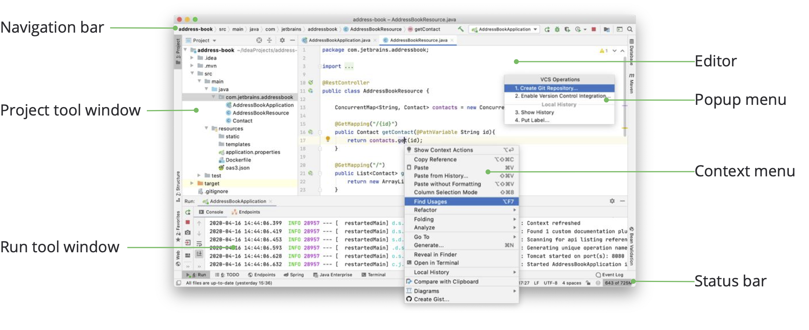
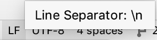
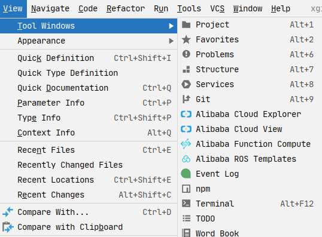
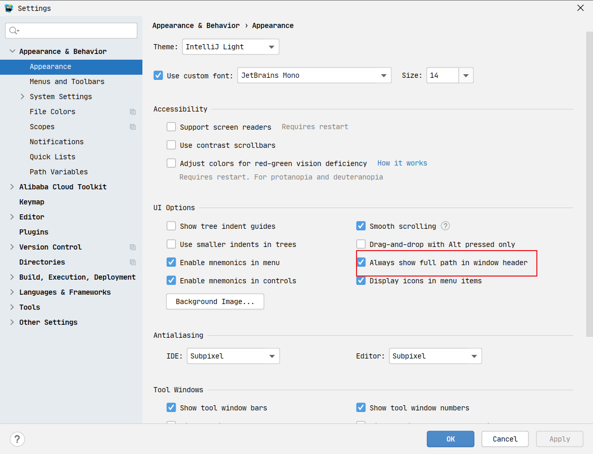

## Intellij IDEA 用户界面概述

当你在 IntelliJ IDEA 中打开一个项目时，默认的用户界面如下所示:

根据安装的插件、 IntelliJ IDEA 版本和配置设置，IDE 的外观和行为可能会有所不同。

## 编辑器

IntelliJ IDEA 中部的编辑器，用来书写代码，阅读源代码的地方。

## 导航栏

顶部的导航栏是 Project 工具窗口的一个快速替代选项，在该窗口中，您可以导航项目的结构并打开文件进行编辑。

使用导航栏右侧的按钮来构建 、运行 和调试 应用程序，访问项目结构设置，并执行基本的版本控制操作(如果配置了版本控制集成)。它还包含运行任何东西 (按 `Ctrl` 两次)和搜索无处不在(按 `Shift` 两次)按钮。

这里先留下一个印象，后面还会持续讲到。**不慌！**

## 状态栏

主窗口底部的状态栏左侧显示最新的事件消息和当您用鼠标指针悬停在它们上面时的动作描述。单击状态栏中的消息以在事件日志中打开它。右键单击状态栏中的消息，并选择 Copy 粘贴消息文本，当您正在寻找问题的解决方案或需要将其添加到支持票或 IntelliJ IDEA 问题跟踪器中时。

使用快速访问按钮或在工具窗口之间切换并隐藏工具窗口栏。

状态栏还显示后台任务的进度。您可以单击以显示后台任务管理器。

状态栏的右侧包含一些小部件，这些小部件指示整个项目和 IDE 状态，并提供对各种设置的访问。根据插件集和配置设置，小部件集可以更改。右键单击状态栏以选择要显示或隐藏的小部件。

| 小部件                                                                                                       | 描述                                                                                                                                                           |
| ------------------------------------------------------------------------------------------------------------ | -------------------------------------------------------------------------------------------------------------------------------------------------------------- |
| **52:11**                                                                                                    | 行号和列号除以冒号表示编辑器中当前插入符号的位置。单击数字可跳转到特定的行和列。如果在编辑器中选择代码片段，IntelliJ IDEA 还会显示所选片段中的字符数和换行符。 |
|  | 单击可在编辑器中更改当前文件的行尾。                                                                                                                           |
| UTF-8                                                                                                        | 单击可在编辑器中更改当前文件的编码。                                                                                                                           |
|  | 点击设置当前文件是否可读。                                                                                                                                     |
| **Git: master**                                                                                              | 如果版本控制工具开启，那么这个小组件显示当前版本控制分支，点击可以 进行版本控制                                                                                |
| **2 spaces**                                                                                                 | 单击可更改当前文件中使用的缩进样式。                                                                                                                           |
|  | 显示 IntelliJ IDEA 在堆内存总量中消耗的内存量。有关更多信息，请参阅增加 IDE 的内存堆。                                                                         |

## 工具窗口

工具窗口提供了补充编辑代码的功能。例如，“项目工具”窗口显示项目的结构，“运行工具”窗口显示应用程序运行时的输出。

默认情况下，工具窗口停靠在主窗口的侧面和底部。您可以根据需要对它们进行排列、取消停靠、调整大小、隐藏等等。右键单击工具窗口的标题，或单击其排列选项标题中的“显示选项”菜单按钮。

您可以**指定快捷方式**来快速访问您经常使用的工具窗口。其中一些默认情况下有快捷方式。例如，要打开“项目工具”窗口，请按 Alt+1；要打开“终端工具”窗口，请按 Alt+F12。

要从编辑器跳转到最后一个活动工具窗口，请按 F12 键。

## 弹出菜单

弹出菜单提供与当前上下文相关的操作的快速访问。以下是一些有用的弹出菜单及其快捷方式：

- `Alt+Insert` 打开生成弹出窗口，用于根据上下文生成样板代码。
- `Ctrl+Alt+Shift+T` 打开这个弹出窗口的重构，其中包含上下文可用的重构列表。
- `Alt+Insert` 在“项目工具”窗口中打开新弹出窗口，用于向项目添加新文件和目录。
- `Alt+` ` 打开 “VCS 操作” 弹出菜单，其中包含版本控制系统的可用操作。
  可以使用常用动作的快速列表创建自定义弹出菜单。

## 主窗口

主窗口包含单个 IntelliJ IDEA 项目的所有信息。可以在多个窗口中打开多个项目。默认情况下，窗口头包含项目的名称和当前打开的文件的名称。如果有多个模块，它还会显示相关模块的名称。

在头部显示项目全路径

